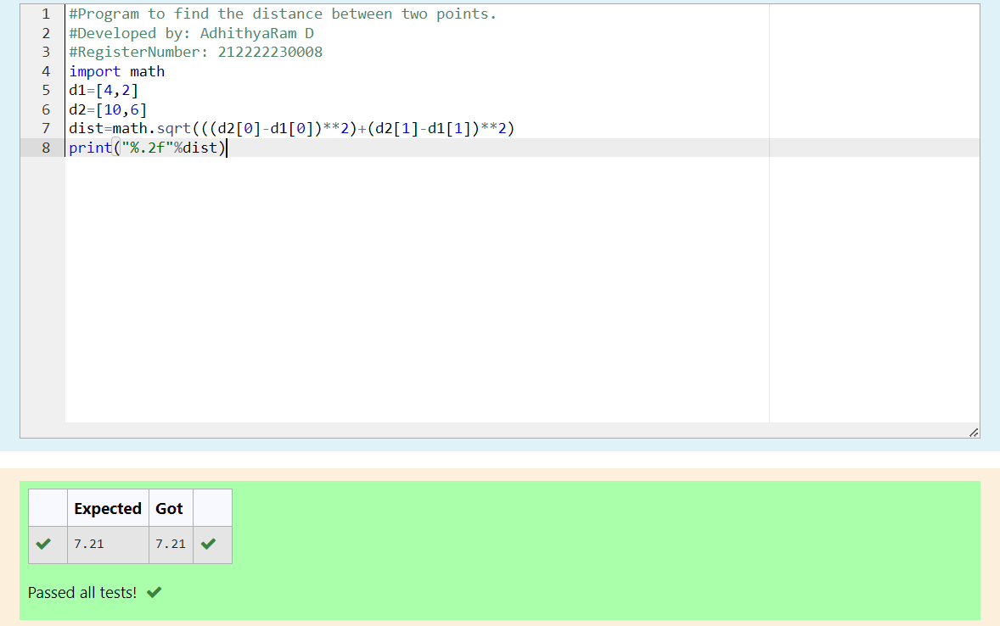

# DISTANCE-BETWEEN-TWO-POINTS

## AIM:
To write a python program to find the distance two 2 points
## ALGORITHM:
### Step 1: 
Import Math
### Step 2:
Give the list
### Step 3: 
Substitute the values in the distance formula  
### Step 4: 
Print the solution
### Step 5:
End the Program 
### PROGRAM:
```
#Program to find the distance between two points.
#Developed by: AdhithyaRam D
#RegisterNumber: 212222230008
import math
d1=[4,2]
d2=[10,6]
dist=math.sqrt(((d2[0]-d1[0])**2)+(d2[1]-d1[1])**2)
print("%.2f"%dist)
```


### OUTPUT:


### RESULT:
The Program for Finding the distance between two points is successfully executed.
